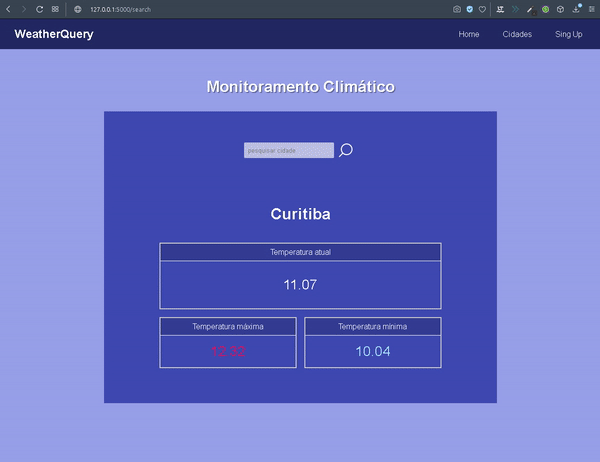

<h2 align="center"> Wthcast </h2>

 

<h3 align="center">Wth é um website para monitorar o clima em tempo real. Os dados climáticos foram obtidos através da API <a href="https://openweathermap.org">Open Weather</a>. O backend do site foi feito com o framework flask, enquanto o front-end com html, css e js.</h3> 

 
 

<h4 align="center">Esse <a href="https://wthcast.herokuapp.com">site</a> está hospedado na Heroku, onde é possível testá-lo :)</h4>

 
 

características/funcionalidades

<ul>
    <li>Site feito com flask</li>
    <li>Para fazer o carousel, foi usado o <a href="https://owlcarousel2.github.io/OwlCarousel2/"> owl carouse l</a></li>
</ul>

  

